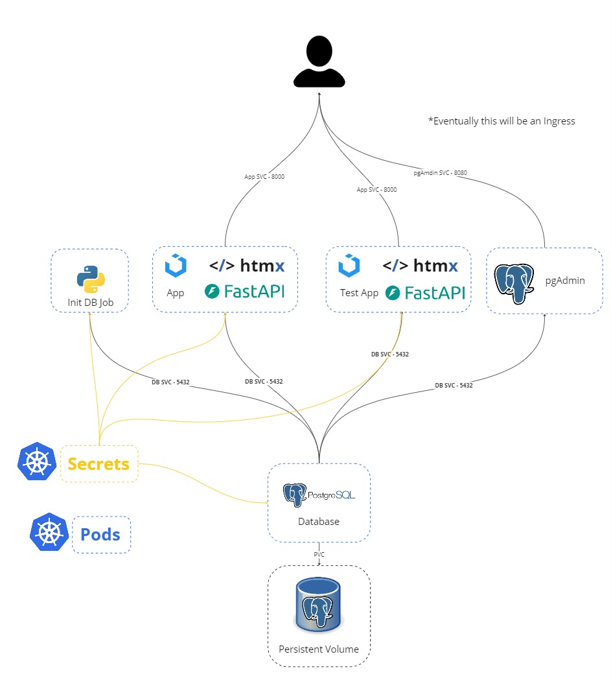

# Pal App Infra
This repo has the necessary helm charts to simplify the deployment of the pal app. This is still a work in progress, and there is a lot more that I want to do, but using helm should at least allow you to get an the app up and running quickly.


## Pre-reqs:
- Kubernetes - recommended to use docker desktop (https://www.docker.com/products/docker-desktop/)
- Helm - (https://helm.sh/docs/intro/install/)

### Required Local Images:
- Database: `pal-postgres`  
- Prod App: `pal`  

Build pal app:
```bash
docker build pal/. -t pal:latest
```

Build pal database
```bash
docker build database/. -t pal-postgres:latest
```

Run App With Helm:
```bash
helm install pal-test ./pal-chart
```
Get Deployment Status
```bash
helm status pal-test
helm get all pal-test
```
*Note: If using the local LLM option this setup may take 10+ minutes (there is a lot to download + initialize)*  

<br/>

Port Forward
```bash
kubectl port-forward svc/<your release name>-pal-svc 80:8000
```
View the app at: http://localhost


### Current Arch:




## Update Pal Submodule
```bash
git submodule update --remote --merge
```