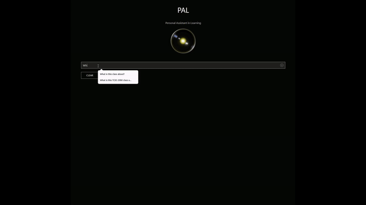
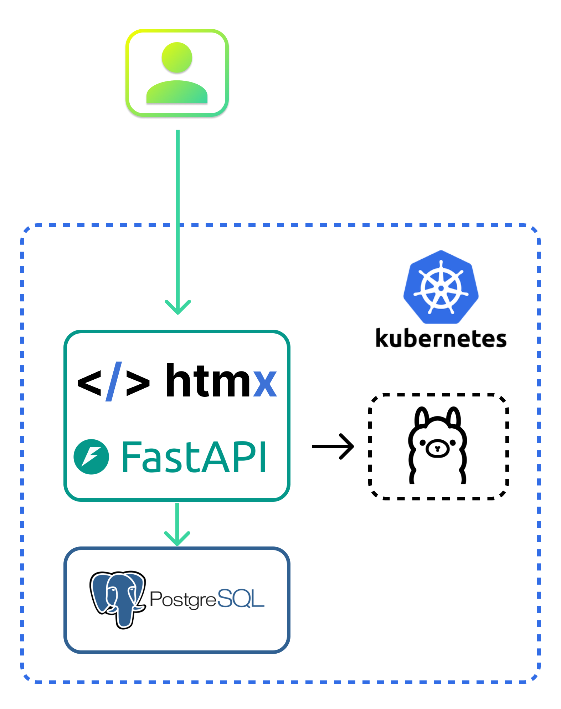
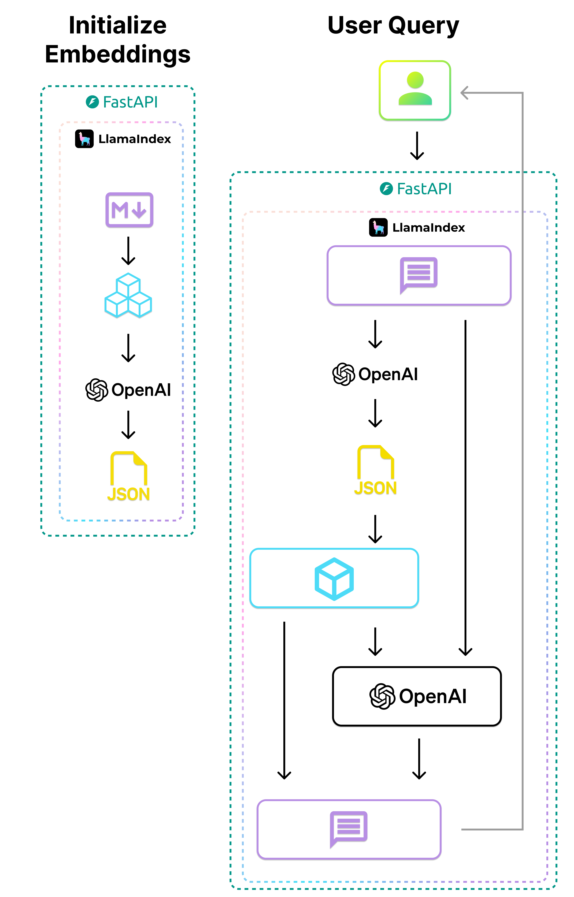
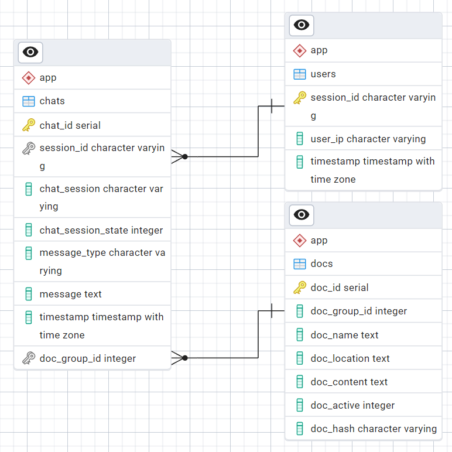

# Pal App Infra
This repo has the necessary helm charts to simplify the deployment of the pal app. The goal is to provide a minimal dependency setup that allows users to test the app out locally, while also being easy to deploy in a production envrionement with minimal changes.  

*This is still a work in progress, and there is a lot more that I want to do*

<br/>


#### Example Chat
Example of question answering over the **TCID 2090** class documents:  


<br/>


## Getting Started

### Pre-reqs:
- [Kubernetes](https://www.docker.com/products/docker-desktop/) - recommended to use docker desktop to run kubernetes locally   
- [Helm](https://helm.sh/docs/intro/install/) - simplifies the app installation process  
- [Git](https://git-scm.com/) - to easily get the repo code  

### 1. Clone the repo
```bash
git clone https://github.com/inhighered/pal_infra_public.git
```

### 2. Build Required Images:
- Database: `pal-postgres`  
- Prod App: `pal`  

Build pal app:
```bash
docker build pal/. -t pal:latest
```

Build pal database
```bash
docker build database/. -t pal-postgres:latest
```

### 3. Startting the app

Run App With Helm:
```bash
helm install pal-test ./pal-chart
```
Get Deployment Status
```bash
helm status pal-test
helm get all pal-test
```
*Note: If using the local LLM option this setup may take 10+ minutes (there is a lot to download + initialize)*  

<br/>

Port Forward
```bash
kubectl port-forward svc/<your release name>-pal-svc 80:8000
```
View the app at: http://localhost


## Technical Details 

### App Architecture



<br/>

### App Flow


<br/>

### Database Schema
The database collects annonamous usage information that can be used to evaluate chat responses.  




<br/>


#### Updating Pal Submodule
The core app code is in the Pal submodule
```bash
git submodule update --remote --merge
```

#### Future steps
Next up I'm planning on automatically building the docker images and helm chart, so a user just needs to install directly from the helm repo instead of pulling the source code.